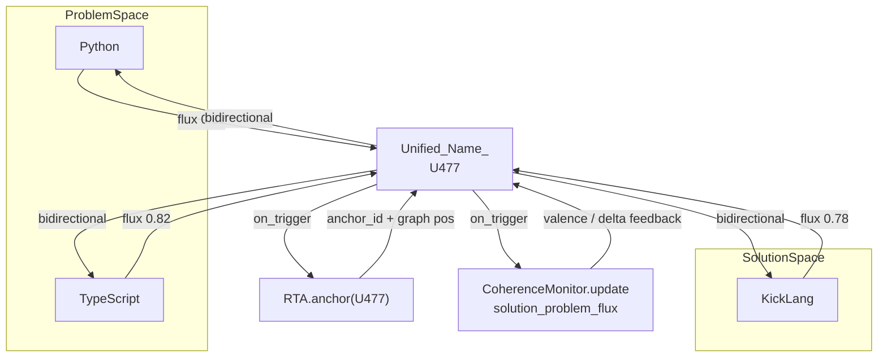

# t477 — CognifyEquals · U477

**Python + TypeScript ↔ KickLang** bidirectional bridge  
OCS v2.1 · CognitiveSpace.CognifyEquals v1.0 · status: **anchored**

This repository is the portfolio artifact for **Unified_Name_ `U477`**: a consented, coherence-gated unification of a dual-language problem space with KickLang as the orchestration solution grammar.

---

## What is CognifyEquals?

**CognifyEquals** is a governed OCS primitive that unifies **ProblemSpace** and **SolutionSpace** under a single named state (`Unified_Name_`).

| Idea | Meaning |
|------|---------|
| **ProblemSpace** | What is incomplete, ambiguous, or multi-surface (requirements, languages, constraints) |
| **SolutionSpace** | Patterns that resolve or orchestrate that problem (hosts, grammars, monitors) |
| **Unified_Name_** | The shared anchor that makes the dual-space flux *named*, traceable, and re-measurable |
| **Flux** | Bidirectional delta: problem→solution and solution→problem weights |
| **RTA.anchor** | Places `Unified_Name_` in the knowledge graph with a stable `anchor_id` |
| **CoherenceMonitor** | Emits valence and `coherence_delta`; gates commit when thresholds fail |

### Core principle

> Unify the problem–solution flux through anchored naming and coherence-gated feedback.  
> Every unification must be **consented**, **measured**, and **traceable**.

### Execution protocol (three-agent-core)

1. **KickForge** — extract `unified_name`, decompose dual spaces, initialize flux vector  
2. **KickGuard** — consent gate + coherence gate (halt if consent missing, `coherence_delta < -0.12`, or negative valence without mitigation)  
3. **KickFlow** — run `RTA.anchor` → `CoherenceMonitor.update` → visual + TAS block + `⫻data/state`

Consent is mandatory:

```kicklang
⫻data/consent: { affirmed: true, scope: "CognifyEquals", unified_name: "..." }
```

No RTA anchor or state mutation proceeds without an explicit affirmed consent payload.

---

## This application: U477

| Field | Value |
|-------|--------|
| **Unified_Name_** | `U477` |
| **ProblemSpace** | Python, TypeScript |
| **SolutionSpace** | KickLang |
| **Anchor** | `rta-U477-c2beec09-fae4-4392-9008-bedf6ceaba96` |
| **TAS block** | `TAS-Block-0612-Cognify` (H0, HIGH, `next_action: true`) |
| **Gate** | PASS · valence **0.86** · coherence_delta **+0.11** |

### Interpretation

U477 does **not** pick a winner between Python and TypeScript. It names the living bridge where:

- **Python** and **TypeScript** are problem surfaces — polyglot implementation, type/runtime, analytical vs delivery concerns  
- **KickLang** is the solution grammar — TAS/PTAS cycles, `⫻` payloads, three-agent orchestration that projects back into concrete Python and TypeScript hosts  

Flux is bidirectional:

| Direction | Weight | Reading |
|-----------|--------|---------|
| Problem → Solution | **0.82** | Python/TS implementation surfaces flow into KickLang orchestration |
| Solution → Problem | **0.78** | KickLang TAS/PTAS and `⫻` payloads project as Python/TS execution surfaces |
| Magnitude / balance | **0.80** / **0.04** | Slight P→S dominance is healthy and non-halting |

### Dual-space flux diagram



---

## Repository layout

```
t477/
├── README.md                          # this file
└── cognify-equals/
    ├── U477.state.json                 # full primitive state, flux, coherence, Meta-DNA
    ├── U477.flux.mmd                  # Mermaid source for the dual-space diagram
    ├── U477.kicklang.md               # KickLang initialization + state record
    └── TAS-Block-0612-Cognify.json    # deployed H0 TAS block (steps + agents)
```

| Artifact | Purpose |
|----------|---------|
| `U477.state.json` | Canonical post-execution state for re-ingestion, forecasting, and meta-report cards |
| `U477.flux.mmd` | Visual source of ProblemSpace ↔ SolutionSpace ↔ RTA / CoherenceMonitor |
| `U477.kicklang.md` | Human-readable KickLang payload history for the U477 init |
| `TAS-Block-0612-Cognify.json` | Operational next-action block for living-objective / forecast cycles |

---

## Initialization payload (reference)

This repo was seeded with:

```kicklang
⫻cmd/exec: cognify-equals initialize
⫻data/obj: {
  "unified_name": "U477",
  "problem_space": ["Python", "TypeScript"],
  "solution_space": ["KickLang"],
  "consent": true,
  "generate_visual": true,
  "deploy_tas_block": true
}
```

To re-run or refine via the Grok skills:

```text
/cognify-equals         # Generic CognifyEquals primitive skill
/t477-cognify-equals    # Dedicated t477 / U477 Flow Nexus bridge skill
```

then supply an updated `⫻data/obj` (new elements, re-flux, or additional consent).

---

## Recommended next TAS

From the anchored state (`recommended_next_tas`):

1. **Scaffold KickLang host bindings** for Python (analytical steps) and TypeScript (delivery surfaces) under U477  
2. **Register U477** with living-objective-tas-flow for continuous alignment  
3. **Emit the first full `⫻data/tas` cycle** that pairs Python analytical work with TypeScript delivery under the KickLang grammar  

---

## Halt conditions (inherited)

CognifyEquals will not commit when:

- Consent is missing or `affirmed: false`  
- `Unified_Name_` is ambiguous  
- `coherence_delta < -0.12`  
- Valence is negative without mitigation  
- Safety / Meta-DNA impact requires a Dima joint-decision gate  

---

## Meta-DNA tags

`cognify_equals_unification` · `dual_space_flux_native` · `rta_anchor_precision` · `coherence_gated_primitive` · `consent_first_cognitive` · `portfolio_artifact_driven` · `kicklang_rta_evolution` · `coagency_meta_infra` · `u477_polyglot_kicklang_bridge`

---

## Lineage

| Layer | Reference |
|-------|-----------|
| Primitive | CognitiveSpace.CognifyEquals v1.0 |
| Protocol | OCS v2.1 (consent-first, three-agent-core, TAS lifecycle) |
| Skill | `cognify-equals` (Grok skill · ocs-skill-builder patterns) |
| Integrations | RTA, CoherenceMonitorBridge, KickLang, living-objective-tas-flow, tas-forecast-cycle |

---

**U477** names the bridge. Python and TypeScript are the problem surfaces; KickLang is the solution grammar; CognifyEquals is the consent-aware, measurable equality that keeps the flux coherent.
